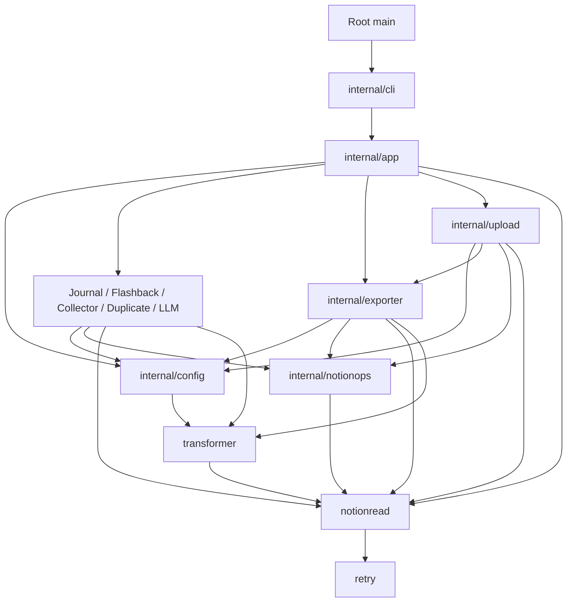

# Repository restructure specification

- Status: **Implemented — direct-switch refactor**
- Created: 2026-09-05
- Decision owner: repository maintainer
- Scope: Go organization, testability, regression evidence, and documentation

## 1. Intent and authority

Restructure notion-toolset so a contributor can find one workflow, understand its
dependencies and effects, change it within a clear boundary, and verify the
supported behavior without live Notion or LLM credentials.

The owner requested better project structure, tests, and documentation, and
clarified that this personal project will use a one-time migration with a direct
switch. No compatibility shims, parallel implementations, or staged adoption are
required. Public CLI commands must continue to work. The owner delegated the
render-session lifecycle decision and asked for a simple, fail-fast design with
no speculative concurrency machinery; P6 records that decision.

This specification resolves the design prerequisites. Editing it does not
execute the refactor or authorize remote writes or release publication.

This is the canonical specification for the restructure. Current implementation
ownership remains in [architecture.md](../architecture.md), current commands in
[DEVELOPMENT.md](../../DEVELOPMENT.md), and historical setup evidence in
[agent-setup.md](../agent-setup.md). On implementation, update those current owners
and retain this document as the decision and scope record; do not keep competing
copies of current architecture here.

## 2. Evidence and problems to solve

The following were confirmed from the pre-refactor working checkout based on commit
`c252305`, including the uncommitted initial agent setup:

| Current owner | Observed friction | Desired property |
| --- | --- | --- |
| [main.go](../../main.go) | Global flags, YAML decoding, environment lookup, process exits, command construction, and repetition share one file/package | CLI/process concerns can be tested separately from workflow execution |
| Root workflow files | All eight command paths share `package main`, so unrelated code can access each other's internals | Compile-time package boundaries reflect coherent responsibilities |
| [reverse_upload.go](https://github.com/zhuochun/notion-toolset/blob/c252305fcac093db34923cc55145c94fd53c86a1/reverse_upload.go) | Git operations, parsing, comparison, Notion writes, HTTP handlers, and embedded HTML occupy one 1,310-line file | Related code stays together, with separate files and explicit dependencies |
| Export/upload integration | ReverseUploader initializes the exporter's reader and download channel and waits for its workers | Rendering and asset-resource ownership have one API instead of caller-managed exporter internals |
| `Validate` methods | Some validate, some apply defaults, LLM validation creates a client, and journal validation is a no-op | Those responsibilities become identifiable while preserving the current external sequence and results |
| [transformer/](../../transformer/) | Rendering, aliases, filenames, and asset futures have little direct test evidence | Representative output and boundary cases are protected before reorganizing internals |
| Documentation | Setup and commands exist, but flags/configuration and failure behavior are not comprehensive | Users and contributors have distinct, complete reference owners |

The initial setup's recorded `go test -count=1 -cover ./...` results were 20.5%
for the root package, 85.0% for notionread, 56.0% for retry, and 5.2% for
transformer. These are historical package-local statement measurements, not
aggregate coverage or proof that the workflows are safe to change. Existing tests
already cover important pagination, snapshot, filename, cleanup, and batching
behavior; retain that evidence.

## 3. Scope and preserved contracts

### Included

- Extract root implementation into importable internal packages.
- Make process inputs and independently varying external collaborators explicit.
- Separate reverse-upload concerns and remove its access to exporter internals.
- Add regression evidence around the workflow boundaries being moved.
- Document command/configuration behavior, code ownership, and focused checks.
- Preserve the shared local/CI verifier and root build/install path.
- Switch all in-repository callers directly to the new owners in one change;
  remove replaced root implementations rather than introducing shims.

### Excluded

- New commands, subcommand syntax, configuration versions, or an SDK redesign.
- YAML-library, Notion/OpenAI-library, toolchain, or module-path migrations.
- Changes to failure aggregation, retries, timeouts, date semantics, defaults,
  supported Markdown, cleanup policy, upload replacement, or API permissions.
- New persistence, background services, queues, plugins, dependency-injection
  frameworks, a frontend build system, or an application-wide event bus.
- Transitional command registries, compatibility wrappers, dual-running old/new
  paths, migration flags, or a separate rollout framework.
- Arbitrary coverage targets, mandatory mutation/fuzz testing, or broad CI changes.
- Commits, remote settings, live Notion/LLM execution, deployment, and release.

Preserve the following until a separately accepted behavior change says otherwise:

| Surface | Compatibility commitment |
| --- | --- |
| Executable | `go run .`, `go build .`, root module installation, released binary names, and current release build inputs continue to work |
| CLI | Command names and all flags, including `--one`, `--multi`, `--idx`, `--repeat`, `--mode`, `--workspace`, and `--port`; help, defaults, selection order, and exit classification |
| Configuration | YAML keys, scalar/null/zero handling, template inputs, default timing, multi-config behavior, and the config-free `--one` path |
| Environment | `NOTION_TOKEN`, `DOT_OPENAI_KEY`, `DOT_OPENAI_URL`, endpoint selection, and command-specific credential requirements |
| Public packages | Existing imports and exported contracts of `notionread`, `retry`, and `transformer` remain available |
| Output/data | Markdown bytes and decorations, aliases, slugs/collisions, asset paths, journal names/dates, chain-file format, and Git status/path interpretation |
| Effects | Notion request ordering/batching and retry policy, scan/write sequencing, partial-failure behavior, directory boundaries, and resolve-server host/routes |
| Evidence | Existing test assertions remain exercised through the new owners; full verification still covers `./...` with no focused selector |

Logs are operational output: preserve actionable content, severity, destination,
and failure classification. Wall-clock timestamps and already nondeterministic
worker/map ordering are not new byte-for-byte promises. Do not make logging
changes merely because code moved.

## 4. Target folder structure

Use one Go module and a thin root executable. Go's official guidance supports a
command at the module root with supporting packages under `internal/`; it does
not require a `cmd/` directory for every CLI. Keeping the root entry preserves the
current invocation and installation path. [Go module layout guidance](https://go.dev/doc/modules/layout)

The tree describes the intended completed structure. File names within a package
may be adjusted when they improve clarity; package responsibilities and compatible
entry points are implementation constraints. Test files are colocated with owners,
and fixture directories are created only for actual fixtures.

```text
notion-toolset/
├── main.go                       # Thin process adapter; root executable stays
├── main_test.go                  # Built-binary/process compatibility tests
├── go.mod
├── go.sum
├── AGENTS.md                     # Routes to current owners and evidence
├── README.md                     # User quick start and links to reference
├── DEVELOPMENT.md                # Contributor setup, checks, release procedure
├── LICENSE
├── internal/
│   ├── cli/
│   │   ├── run.go                # Args/help/output and process-result mapping
│   │   ├── flags.go              # Per-invocation flag.FlagSet; no global flags
│   │   └── run_test.go
│   ├── app/
│   │   ├── run.go                # Command selection, repeat/multi orchestration
│   │   ├── commands.go           # Composition of the concrete workflows
│   │   ├── runtime.go            # Clients, run-scoped read composition, defaults
│   │   └── run_test.go
│   ├── config/
│   │   ├── config.go            # YAML input types and shared config error identity
│   │   ├── load.go              # Single/multi decoding; returns errors
│   │   └── config_test.go       # Decode and canonical example contracts
│   ├── journal/
│   │   ├── daily.go
│   │   ├── weekly.go
│   │   ├── dates.go             # Journal scheduling, not generic date utilities
│   │   └── journal_test.go
│   ├── flashback/
│   │   ├── flashback.go         # Selection, journal target, and chain output
│   │   └── flashback_test.go
│   ├── collector/
│   │   ├── collector.go         # Existing-page discovery and batched collection
│   │   └── collector_test.go
│   ├── duplicate/
│   │   ├── duplicate.go         # Duplicate keys and reporting policy
│   │   ├── url_check.go         # Broken-link check and HEAD/GET fallback
│   │   └── duplicate_test.go
│   ├── exporter/
│   │   ├── export.go            # Scanning, traversal, file export, cleanup timing
│   │   ├── render.go            # Render-session API shared with upload
│   │   ├── assets.go            # Downloads and worker lifetime
│   │   ├── files.go             # Managed paths, filename use, cleanup rules
│   │   ├── export_test.go
│   │   └── testdata/            # Actual export/asset/partial-read fixtures
│   ├── upload/
│   │   ├── upload.go            # Mode orchestration and Notion write policy
│   │   ├── compare.go           # Local/base/remote comparison and statuses
│   │   ├── git.go               # Git invocation, pathspecs, restore/clean
│   │   ├── markdown.go          # Current supported Markdown-to-block conversion
│   │   ├── resolve.go           # Local HTTP lifecycle, handlers, shared UI state
│   │   ├── resolve.html         # Existing UI, embedded with go:embed
│   │   ├── upload_test.go
│   │   ├── resolve_test.go
│   │   └── testdata/
│   ├── llm/
│   │   ├── llm.go               # Per-page/group execution and filtering
│   │   ├── output.go            # Result-to-Notion block construction/writing
│   │   └── llm_test.go
│   └── notionops/
│       ├── query.go             # Template-to-query construction; delegates reads
│       ├── templates.go         # Existing template semantics and input builders
│       ├── append.go            # Block payload construction and batch submission
│       └── notionops_test.go
├── notionread/                   # Existing public API and read-only owner retained
│   ├── doc.go
│   ├── reader.go
│   ├── snapshot.go
│   └── reader_test.go
├── retry/                        # Existing public backoff API retained
│   ├── retry.go
│   └── retry_test.go
├── transformer/                  # Existing public rendering API retained
│   ├── doc.go                    # Add explicit responsibilities and limitations
│   ├── ...                      # Existing rendering/slug/alias/future implementation
│   ├── *_test.go
│   └── testdata/                 # Versioned input and expected Markdown fixtures
├── scripts/
│   └── verify/                   # Existing full-verification entry; unchanged scope
├── docs/
│   ├── architecture.md           # Current ownership, updated with the direct switch
│   ├── commands.md               # All commands, flags, effects, failure behavior
│   ├── configuration.md          # All YAML fields, defaults, templates, environment
│   ├── agent-setup.md            # Historical setup evidence
│   └── specs/
│       └── 202609-repo-restructure.md
├── example/                      # Existing paths remain compatible
│   ├── configs/
│   ├── workflow/
│   └── gitlab-ci.yml
├── data/                         # Retained; no deletion inferred from this tree
└── .github/
    ├── workflows/
    │   ├── verify.yml
    │   └── release-binaries.yml
    └── ...                      # Existing repository metadata remains
```

Do not add `pkg/`, `src/`, a module per workflow, or an empty top-level `tests/`.
The existing public directories retain their implementations; no compatibility
facades or forwarding aliases are introduced. The thin root `main.go` is the
canonical executable, not a shim to a second executable. A future multi-binary
requirement can reopen `cmd/` placement with explicit command compatibility work.

## 5. System design principles

### P1. Keep workflow decisions together

Each workflow owns its selection rules, defaults, validation policy, ordering,
effects, and interpretation of partial results. `app` composes workflows and owns
multi-config/repeat execution; it must not become the new home of every helper.
`notionops` owns the shared query/template/write mechanisms already used by
multiple workflows. It does not decide which pages to collect or delete.

Daily and weekly journals share one scheduling responsibility and belong together.
Upload's Git, parser, and HTTP concerns initially become files within one package;
they do not each need another package/interface. Split further only when actual
consumers or responsibilities justify it.

### P2. Dependency direction is explicit and acyclic



Arrows show allowed important imports, not a requirement for every workflow to
import every dependency. SDK/standard-library edges are omitted. `config` may
refer to the existing public `transformer.MarkdownConfig`; avoid a duplicate
rendering-options schema. No workflow imports `app` or `cli`; none of the public
support packages imports an application workflow. `exporter` never imports
`upload`. Workflow-to-workflow coupling is limited to upload's render-session
dependency in this design. `app` supplies the run-scoped read dependency shared
by upload and its render session; upload's fresh pre-write reads go directly
through that `notionread.Reader`, not through exporter internals.

### P3. Configuration representation and behavior have distinct owners

`config` owns the YAML envelope/input types, decoding, and shared required-config
error identity. It imports no workflow packages. Each workflow owns the meaning
of its section: normalization, required fields, and conversion to executable
options. A field's default has one implementation owner, documented by reference.

Move the existing types without redesigning the schema. Preserve runtime
`yaml.Unmarshal` semantics and the separately stricter example checks. Do not
introduce blanket validation of inactive command sections. Splitting validation
from setup must preserve the order in which defaults, credentials, errors, and
side effects become observable.

### P4. Process concerns end at the CLI boundary

Use a fresh `flag.FlagSet` for each invocation. The CLI accepts explicit arguments,
environment access, and output streams so tests can invoke it repeatedly without
mutating process-global flags. The root entry performs process termination;
configuration/application code returns results or errors with enough information
to preserve current exit classification and diagnostic text.

Client construction belongs to `app` runtime composition, with command-specific
construction at the existing lifecycle point. In particular, non-LLM commands
must not start requiring LLM credentials, and restructuring must not change
which error appears first when both credentials and configuration are invalid.

### P5. Add interfaces where consumers need them

Prefer concrete implementations and standard-library collaborators. Introduce
interfaces at their consuming boundary only when the collaborator varies
independently or a genuine external contract needs isolation. Do not create a
parallel interface for every concrete type or mirror the complete Notion SDK.
This follows Go's guidance on consumer-owned interfaces. [Go code review guidance](https://go.dev/wiki/CodeReviewComments#interfaces)

Examples include workflow time/random sources, an HTTP client/transport,
LLM completion, and the renderer consumed by upload. Use a real temporary Git
repository to exercise Git semantics before considering a repository-wide Git
abstraction. Keep a small command contract in `app` only for the dispatch and
validation/execution behavior it actually coordinates.

### P6. A resource has one lifecycle owner

`exporter` owns download/render resources; upload must not initialize or close
its channels, obtain a reader through its internals, or coordinate its wait
groups. The render session borrows an explicitly supplied reader. Use one concrete
`RenderSession` with a constructor, `RenderPage`, and `Close`; no session manager,
pool of sessions, asynchronous job API, or interface hierarchy is needed.

The lifecycle contract is:

- **Construct:** accept the shared reader, normalized rendering/asset settings,
  and download client. Reject missing internal prerequisites before starting
  workers. Start the existing bounded asset workers only after those checks;
  construction makes no Notion request. The caller defers `Close` immediately
  after successful construction.
- **RenderPage:** synchronously obtain the page and best-effort snapshot, render
  Markdown, and return the remote page plus rendered bytes or the existing read
  error. Asset futures needed by the render settle before it returns. Return a
  terminal error immediately instead of adding recovery or session-level retries;
  existing Notion read retries and renderer asset-error fallback remain intact.
  A failed render leaves the session open for the caller's existing per-file
  continuation policy.
- **Serial use:** one ordinary mutex serializes `RenderPage` and `Close`. This
  also handles overlapping resolve-UI HTTP requests without concurrent access
  to the session. No busy-response protocol, new HTTP status, scheduling layer,
  or fairness guarantee is introduced.
- **Close:** wait for an active render through that same mutex, stop asset input,
  drain and join the existing download workers, then mark the session closed.
  Repeated close is a no-op; rendering after close returns an error before any
  I/O. Close does not close the borrowed reader/client, submit Notion writes, or
  change completed render results. It has no error result: download errors are
  handled by the existing render/logging path, not deferred as a new CLI failure.
- **Operation lifetime:** a normal upload run closes on return. Resolve mode
  keeps its session for the existing server lifetime; do not add background
  cleanup or a new shutdown protocol. Internal cleanup uses the same synchronous
  close path if that owning operation returns.

Bulk export retains its current worker pool and streaming file-write path. It
shares the private rendering/download implementation with the upload session;
it must not send all export workers through one serialized session or buffer
every exported page just to match upload's byte-returning API. This preserves
existing export concurrency and file-effect timing while keeping upload simple.

For each upload run, `app` runtime composition supplies a factory that creates one
`notionread.Reader` using the command's normalized export-speed settings. Upload
invokes it at the existing session-start point, after candidate discovery, and
passes that same instance to its own execution path and the render session.
`notionread` owns the reader's retry, pagination, limiter, and concurrency state;
the application factory owns construction and run scope. Retain the existing
limiter rate/burst and concurrency configuration from `newNotionReader`. Do not
create a second reader/budget for replacement, reset it between comparison and
replacement, or share it across otherwise separate command runs. Session close
owns download completion, not the independently supplied reader's lifetime.

Upload owns the decision to enumerate current top-level children immediately
before replacement. Preserve the sequence in
[ReverseUploader.uploadPage](https://github.com/zhuochun/notion-toolset/blob/c252305fcac093db34923cc55145c94fd53c86a1/reverse_upload.go): after comparison, perform
the optional title update, prepare replacement blocks, call `BlockChildren` on
the shared reader for a fresh paginated enumeration, delete the returned children
in their existing order, then append the replacement blocks. Do not reuse the
comparison snapshot's children, substitute a one-page SDK read, or route reads
around the shared limiter. A title-update failure stops before enumeration; a
child-read failure stops before any child deletion or append, although an earlier
title update can remain. A deletion failure stops subsequent deletions and append;
already completed effects remain. This preserves existing partial failure and
does not promise an atomic snapshot or replacement.

Rendering for comparison does not run database export or stale-file cleanup.
It may download configured assets, as the current comparison path does; document
that effect rather than implying comparison/dry-run is completely free of local
writes. Upload retains its own comparison state, Git effects, and Notion writes.

The session encapsulates the existing `transformer.AssetFuture` protocol without
changing its public API. A single owner completes each future and terminates its
workers. Retain existing read budgets and asset/export worker bounds. Serializing
session use requires no redesign of the existing read/download mechanisms and
does not introduce signal handling, deadlines, retries, or cancellation outcomes.

### P7. Separate deterministic decisions from I/O when it clarifies behavior

Date calculations, duplicate-key selection, Markdown conversion, merge-state
classification, and managed-path decisions should be testable with explicit
inputs. Clocks default to the same local-time behavior; randomness retains its
current sampling policy. Keep simple functions simple instead of building a
generic clock, filesystem, or scheduling framework.

The transformer reads files for alias lookup and can wait on asset downloads.
Document those effects and test them with controlled fixtures. Do not claim the
renderer is pure or move every rendering decision into a new public API.

### P8. Structural improvements do not redefine failures or data safety

For new internal contracts, fail fast with a useful error when prerequisites are
missing or a closed session is used. Do not build recovery layers for programmer
mistakes. Preserve the command outcomes for existing partial workflow failures.

The current implementation includes logged partial failures, panic paths for
some malformed query templates, and replacement writes that are not atomic.
Characterize these outcomes before moving the owner. Preserve them in this
structural scope, explicitly identify them in documentation, and route proposed
repairs as separate behavior changes. Do not turn a refactoring test into an
assertion that an observed unsafe outcome is the desired long-term design.

In particular, do not add automatic retries to Notion writes: a lost response can
make retrying duplicate an effect. Preserve the existing distinction between
read retry policy and workflow write policy. Do not expand the resolve server's
binding, Git path scope, credentials, or outbound endpoint behavior.

### P9. Compatibility includes dependencies and operational entry points

Keep public package paths and signatures, root command/build/install behavior,
example paths, and the embedded resolve UI usable from a released binary.
Moving the HTML to `resolve.html` uses `go:embed` and preserves its content and
serving behavior; it must not introduce a runtime working-directory dependency.

Do not move code into a package by exporting all formerly private fields.
Add only APIs justified by actual consumers, keep policy behind their owner, and
remove the old implementation when its replacement is adopted. File moves require
review of both the removed and added sides so behavior/tests are not lost.

### P10. Move tests and update documentation with the code

Move tests with the code they cover. Place new fixtures in the consuming
package's `testdata/`; keep canonical user examples under `example/configs/` and
make tests find that owner reliably after package moves. Do not copy examples
into several fixture directories and allow them to drift.

Golden-output comparisons cover representative supported content and preserve
known nondeterminism explicitly. Updating expected output is a reviewed behavior
decision, not the default response to a failing refactor test. Prefer observable
results, requests, files, and failure outcomes over assertions that freeze private
fields or the number of helper calls.

## 6. Boundary changes and representative flows

| Boundary | Current | Target | Must remain unchanged |
| --- | --- | --- | --- |
| Process/application | Global flags and process exits inside loading/orchestration | Root process adapter -> CLI -> app -> selected workflow | Flags, error precedence, exit classification, config selection/repeat order |
| Application/config | Root config envelope directly references root workflow types | `config` input schema decoded once at the appropriate current point; workflow policy stays local | YAML representation and default/validation timing |
| Export/upload | Upload builds exporter internals, shares their reader for comparison/replacement, and manages download workers | App supplies one run-scoped reader to upload and the render session; exporter owns download resources; upload owns fresh pre-delete enumeration and writes | Comparison bytes, asset effects, completeness mode, shared read budget, fresh enumeration/write order, resource completion |
| Upload/UI | Large inline template and handlers mixed with Git and parsing | Same package, focused files, embedded HTML | Binary packaging, routes, localhost binding, response/actions |
| Public support code | Importable notionread/retry/transformer packages | Retained paths and APIs, clearer docs and colocated tests | Existing consumers' compilation and behavior |

Representative export flow:

```text
CLI inputs -> app selects export -> workflow applies current setup/validation
  -> database scan through notionops/notionread
  -> workflow-controlled page traversal and export workers
  -> shared private renderer -> snapshot + transformer + configured asset downloads
  -> managed Markdown files -> wait for existing work -> current cleanup policy
```

Representative reverse-upload flow:

```text
CLI mode/config -> app selects upload -> Git candidate discovery
  -> app-supplied factory creates the run-scoped reader
  -> inject that same reader into upload and the remote render session
  -> local/base content + remote render session -> existing comparison result
  -> current mode: report / Git discard / Notion replacement / resolve HTTP UI
  -> release render resources at the existing operation's completion boundary
```

For a file that proceeds to Notion replacement:

```text
comparison -> optional title update -> prepare replacement blocks
  -> fresh paginated BlockChildren through the same run-scoped reader
  -> delete the returned children -> append replacement blocks
```

Representative collector flow:

```text
discover already-collected IDs -> scan candidate pages and exclude those IDs
  -> only after the complete scan succeeds, write the accumulated new IDs
  -> retain existing batch-failure continuation, counts, logging, and Run result
```

Discovery or scan failure prevents all collection writes, including writes for
candidates already seen before a later scan failure. An empty new-ID set submits
no append request. Preserve this orchestration separately from helper behavior.

These flows define the target ownership. They do not establish transactionality,
successful recovery, or a new definition of dry-run.

## 7. Required regression coverage and acceptance claims

These requirements define acceptance of the restructure. Before moving code,
implementers should identify or add tests for each affected requirement. Reuse
the existing verifier; new platform or race checks need a separate bounded scope.

| Key | Claim | Representative conditions |
| --- | --- | --- |
| CHG-01 — Stable executable | Existing root source/build/install and released-binary invocation remain usable | Help, unknown flags/commands, invalid config, absent token; binary launched outside the repository |
| CHG-02 — Repeatable CLI | Multiple in-process invocations do not leak flags/options, while process behavior remains compatible | Different commands/config paths in sequence; `--multi`, selected index, empty list, out-of-range index, repeat values, config-free `--one` |
| CHG-03 — Stable configuration | The same YAML/environment inputs select the same workflow options and failures | Missing/unknown fields, zero/null values, template escaping, inactive sections, every canonical example, endpoint override |
| CHG-04 — Journal and selection parity | Workflow rules survive extraction | Next-Monday boundary, month/year transitions, local time, existing journals, duplicate property OR semantics, already-reported pages, flashback fallback/chain output |
| CHG-05 — Rendering parity | Existing supported content produces equivalent Markdown, filenames, and asset references | Nested blocks, properties, alias lookup, Unicode, reserved Windows names, collisions, EOL handling, assets and partial snapshots |
| CHG-06 — Export parity | Traversal, resource completion, and cleanup observe the same boundaries | Full/incremental/one-page export, cleanup disabled, hidden/subdirectory files, scan failure versus worker failure, asset error |
| CHG-07 — Upload parity | Mode behavior and external effects remain the same | Staged/unstaged/untracked files, paths with spaces/Unicode, missing base, comparison EOLs, Git discard, comparison -> optional title update -> fresh paginated child read -> deletion -> append; changed children since comparison, title/read/deletion/append failures, resolve list/diff/discard responses |
| CHG-08 — LLM parity | Filtering, request composition, grouping, and write outcomes survive extraction | Per-page/group mode, character thresholds, chain input, text/JSON output, missing key, failed completion/write, journal target missing |
| CHG-09 — Resource ownership | Consumers complete the supported operation without controlling another module's channels or leaking its work; comparison and replacement use the same run-scoped read budget | Construction rejects missing prerequisites before starting work; successful/failed render, reuse after failure, serialized overlapping calls, close after active work, repeated close, no I/O after close; shared reader state without budget reset/cross-run sharing; bulk export retains its worker bounds and streaming path |
| CHG-10 — Read/public API parity | Existing exported contracts and read guarantees remain supported | External-package compilation; pagination order/limits, strict/best-effort snapshots, cancellation and retry cases already covered |
| CHG-11 — Evidence continuity | Moving a package does not remove or silently skip its existing assertions | Before/after test inventory, valid fixture discovery, full `./...` selection, intentional failing-control rejection |
| CHG-12 — Usable documentation | A contributor can locate the new owner and execute its checks; a user can identify inputs/effects | Config change, export cleanup change, upload recovery question, adding a command in an existing pattern |
| CHG-13 — Collector orchestration parity | Already-collected IDs are excluded and no collection write occurs until discovery and the entire candidate scan succeed | Collected A plus candidates A/B writes only B; a later scan failure after seeing B writes nothing; discovery failure writes nothing; no new IDs sends no append; write/build batch failures retain existing continuation, counts, logs, and successful Run return |

For failure cases, distinguish equivalence to the current implementation from
desired future safety. For example, a lost upload append after child deletion is
a required characterization case, not a promise that this proposal makes upload
recoverable. A worker error must not silently acquire a new exit status here.

Run `go run ./scripts/verify` before completing the refactor. Package-specific
focused commands and fixture paths must be updated as each owner moves; retain
the broad gate's test/vet/build scope. Coverage may show where more investigation
is useful, but no percentage replaces these claims.

## 8. Documentation contract

- **README.md:** short description, installation, minimal successful examples,
  and links to command/configuration/contributor references.
- **docs/commands.md:** all eight commands and flags, defaults, prerequisites,
  local/remote effects, mode differences, partial-failure outcomes, and practical
  diagnosis/recovery limits. Include upload's Git behavior and Markdown subset.
- **docs/configuration.md:** YAML sections/fields, required versus optional inputs,
  default owner and timing, templates/builders, environment variables, single and
  multi-config examples, and the difference between strict example checks and
  runtime decoding. Link canonical examples rather than maintaining copies.
- **DEVELOPMENT.md:** supported Go setup, root build/run, local API fixtures,
  focused package checks, broad verification, and unchanged release procedure.
- **docs/architecture.md:** implemented package responsibilities, allowed
  dependency direction, resource owners, and failure/coverage limits. Update
  with the completed direct switch; do not describe the target tree as live before
  it is implemented.
- **Package docs and comments:** describe meaningful public contracts and owned
  behavior; explain ordering, completeness, concurrency, and cleanup where they
  matter. Avoid comments that merely repeat a function name.
- **AGENTS.md:** preserve concise routing. It should link the current references,
  not duplicate this spec or accumulate a second implementation checklist.

## 9. One-time direct switch

Implement one coherent change to the target structure. Move the config types,
shared helpers, and workflows, update their imports and tests, and wire `app`
directly to the new concrete implementations. Root `main` calls `cli`, which
calls `app`; no package imports root `main`, and no temporary root-workflow
registry or compatibility layer is needed.

Intermediate local edits may temporarily fail to compile. They are not separately
supported or released migration states. Do not add shims just to keep every file
move independently buildable. Complete the switch, remove the replaced root
implementations, and verify the resulting checkout as one unit.

Keep the executable name, root build/install path, commands, flags, YAML, and
documented outputs working. Check them with the command/config acceptance tests
and full verifier. Update canonical examples, focused check paths, and architecture documentation
in the same change. Preserve the existing uncommitted agent-setup work and all
unrelated files. No rollout framework or separate migration approval is needed.

## 10. Decisions and readiness

| Decision | Implementation contract |
| --- | --- |
| D1 — Executable | Keep the root entry as the real CLI; no second executable or forwarding shim |
| D2 — Existing public packages | Retain their implementations and APIs in place; no facade, alias layer, or consumer-migration machinery |
| D3 — Application switch | Move all repository callers directly to the target config/app/workflow owners in one change |
| D4 — Rendering and upload reads | Use the synchronous, serialized render-session lifecycle in P6 and one run-scoped reader shared with upload's fresh pre-delete reads; retain bulk export workers |
| D5 — Fail fast | Reject new internal contract misuse immediately; preserve existing CLI failure/partial-effect semantics and avoid new recovery layers |
| D6 — Verification | Keep the existing full gate and add regression evidence for the affected behavior; speculative concurrency/platform work is not a prerequisite |

**Completion:** the owner subsequently authorized implementation, and all callers
were switched in one change. The old root workflow implementations are removed;
the canonical executable and public support packages remain. See the
[verification record](202609-repo-restructure-verification.md) for test continuity,
compatibility evidence, independent reviews and limitations. This grants no
remote-write or release authority.
